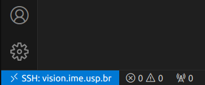
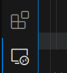
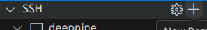
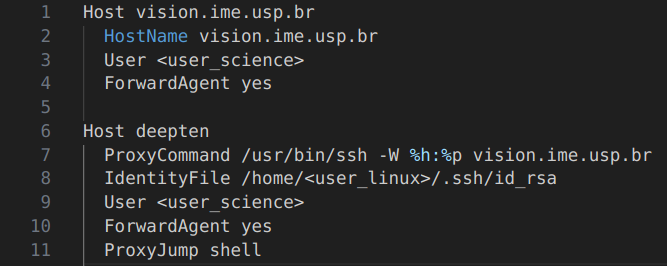
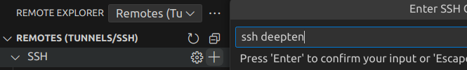
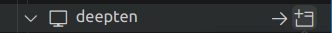
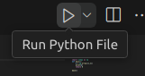
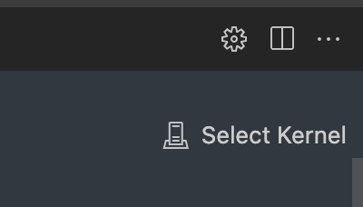

# Acessando e editando código remotamente

Editar códigos que serão executados em uma máquina remota, como na rede e-Science, pode ser complicado, ainda mais se forem necessários testes, experimentações ou prototipagem. Tendo em vista que executar localmente e enviar o código via git não é produtivo, geralmente, ou usamos o VS Code para editar e executar programas diretamente na rede ou editamos e executamos jupyter notebooks na mesma. Por isso, nesta página, segue tanto o tutorial para a edição de programas alocados na rede e-Science a partir do VS Code quanto o tutorial para a configuração e uso de jupyter notebooks na rede.

## VS Code

O VS Code e outras IDEs modernas permitem acesso a pastas via SSH, o que agiliza consideravelmente o desenvolvimento. Este tutorial mostra como conectar o VS Code ao servidor da rede e-Science, permitindo a edição e execução de arquivos diretamente no servidor sem necessidade de transferência de arquivos entre sua máquina local e a rede e-Science.

Vale ressaltar que os comandos deste tutorial para a edição e execução de arquivos a partir do VS Code na rede e-Science devem ser executados em um terminal linux em sua máquina local.

### 1. Instalando Remote - SSH e um client compatível com OpenSSH

Você pode baixar a extensão através da guia de extensões ou direto [marketplace do visualstudio](https://marketplace.visualstudio.com/items?itemName=ms-vscode-remote.remote-ssh).

Feito isso, é necessário instalar um cliente SSH compatível com OpenSSH, caso ainda não tenha, execute em sua máquina local:

```bash
sudo apt-get install openssh-client 
```

Agora, já é possível partir para a configuração do vscode. 

### 2. Configurando o VS Code

Verifique que é possível conectar à rede vision pelo terminal usando:

```bash
ssh <user_science>@vision.ime.usp.br
```

Se isso funcionou, no VS Code, pressione `F1` ou `Ctrl+Shift+P`, que deve abrir o "Command Palette", digite `Remote-SSH: Connect to Host...` e aperte enter. Então, digite o mesmo comando acima, ou seja:

```bash
ssh <user_science>@vision.ime.usp.br
```

Agora, o VS Code irá configurar automaticamente tudo necessário. Agora, basta inserir sua senha da rede e-Science na barra superior e você estará conectado. No canto inferior esquerdo da tela, você verá algo como ```SSH: vision.ime.usp.br``` assim como segue na imagem:



!!! warning "Aviso" 
    Isso irá conectá-lo à máquina de acesso shell. Para encerrar a sessão, clique no ícone azul no canto inferior esquerdo e selecione 'Close Remote Connection', ou, para mudar de máquina, use o comando ```ssh <nome_da_maquina>``` no 'Command Palette', que pode ser aberto com `Ctrl + Shift + P` ou `F1`.

### 3. Salvando as conexões a outra(s) máquina(s) 


#### Aba "Remote Explorer"

Tendo em vista que a extensão Remote - SSH foi instalada, a aba 'Remote Explorer' foi adicionada em seu VS Code, como na imagem que segue:



A partir dela, é possível salvar as conexões estabelecidas a qualquer máquina da rede e-Science.

#### Salvando uma nova conexão

Para salvar uma nova conexão, primeiro, é necessário adicionar a máquina desejada como host no arquivo `config` da pasta `.ssh` assim como é indicado na sessão "Configurando o fácil acesso a máquinas da rede e-Science" na página [Tutorial SSH](./configuring-workplace.md). Posteriormente, basta clicar no ícone "+" como segue na imagem:



digitar `ssh <nome_maquina>` e apertar enter, assim como a sequência de imagens a seguir exemplifica para a conexão à máquina deepten da rede:




Assim, a conexão será salva, de modo que, para se reconectar à máquina pelo VS Code basta seguir o caminho: 

Aba "Remote Explorer" > passar o mouse em cima de `<nome_maquina>` > selecionar "Connect in New Window", assim como em:



### 4. Acessando e editando remotamente

Para abrir um diretório, arquivo ou workspace, você faz exatamente como faria na máquina local:
	
File > Open Folder > ...
    
ou

File > Open File... > ```arquivo```

Quando se trabalha com ambientes Python alternativos (como Anaconda, por exemplo), o VS Code oferece uma maneira simples de alternar entre esses ambientes. Após abrir ou criar um workspace no VS Code, a fim de selecionar o ambiente desejado, siga os seguintes passos:

1. Abra o **Command Palette** no VS Code, pressionando ```Ctrl+Shift+P``` ou ```F1```.

2. Digite e selecione a opção "**Python: Create Environment...**" para criar um novo ambiente, ou escolha "**Python: Select Interpreter**" para selecionar um ambiente existente.

Agora, para confirmar se o python está sendo executado corretamente, basta abrir um programa python de sua preferência e clicar no símbolo de executar do VS Code no canto superior direito, como segue na imagem:



A partir desse ponto, se o programa foi executado corretamente, o ambiente de desenvolvimento está pronto, podendo compilar e editar códigos diretamente na sua conta e máquina sendo usada na rede e-Science em qualquer terminal aberto.


### ssh tunneling
- altere o arquivo .ssh/config na sua máquina local
- adicione a shell como Host e a máquina que você irá fazer o experimento.
- o tunneling também permite que você acesse a máquina interna diretamente

## Configurando Jupyter Notebook via SSH no VS Code

### 1. Conectar via SSH
No **VS Code**, clique no botão de SSH no canto inferior esquerdo e conecte-se ao servidor remoto da vision

### 2. Instale o Jupyter Lab
```bash
pip install jupyterlab
pip install --upgrade 'jupyter-server<2.0.0'
```

### 3. Gerar o arquivo de configuração do Jupyter
No terminal da máquina remota execute:
```bash
jupyter notebook --generate-config
```
Isso criará o arquivo `~/.jupyter/jupyter_notebook_config.py`.

### 4. Editar a configuração do Jupyter
Edite o arquivo de configuração:
```bash
nano ~/.jupyter/jupyter_notebook_config.py
```
Abaixo de `c = get_config()` adicione a linha
```python
c.NotebookApp.token = '<user_science>'  # Ou outro token de sua escolha
```

### 5. Reiniciar a conexão SSH
Reinicie a conexão SSH e conecte-se novamente em alguma máquina com **GPU**

### 6. Iniciar o Jupyter Lab
Na máquina, execute:
```bash
jupyter lab --no-browser --ip=0.0.0.0 --port=8888
```
O terminal mostrará um link contendo o prefixo da máquina semelhante a:
```
http://deepeleven:8888/lab?token=...
```

Copie esse link e substitua `...` pelo token definido:
```
http://deepeleven:8888/lab?token=<TOKEN>
```

### 7. Configurar o Kernel no Jupyter Notebook
- Abra o notebook no VS Code
- No canto superior direito, clique no botão `Select Kernel`
- Selecione `Select Another Kernel` → `Existing Jupyter Server`
- Cole o link modificado com o Token e conecte



### 8. Verificar se a GPU está ativa
No Jupyter Notebook, execute:
```python
!nvidia-smi
```
Se tudo estiver correto, você verá informações sobre a GPU disponível

Para desligar o jupyterlab é só dar um Ctrl+C no terminal

## Possíveis problemas:
- Se mais de um usuário ativo utilizar a mesma porta (ex: `8888`), pode ocorrer um conflito ao rodar o Jupyter. Caso enfrente problemas, tente alterar a porta
- Por padrão, o Jupyter só aceita conexões locais (`localhost` ou `127.0.0.1`). Definir `0.0.0.0` permite que qualquer máquina na rede acesse o servidor Jupyter (desde que tenha permissão). Isso é necessário porque você está acessando o Jupyter de outra máquina via SSH


