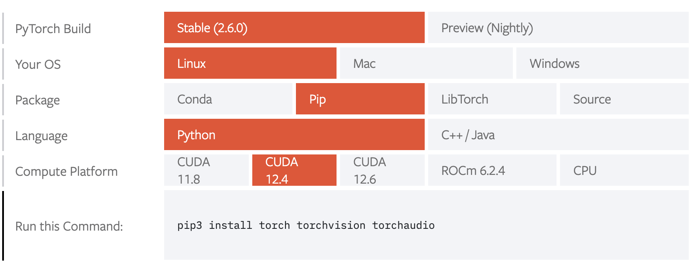

# Uso da GPU e CUDA

Um dos principais motivos para utilizar a rede vision é utilizar suas máquinas para acelerar o processo de treinamento de modelos de Machine Learning (ML), porém, ao receber acesso a rede, é comum que exista dificuldades para utilizar a GPU e obter o melhor desempenho possível das máquinas. Nesse tutorial, iremos discorrer sobre GPUs, CUDA e maneiras para utilizar essas ferramentas de hardware para treinar seus modelos, seguindo as principais bibliotecas de Machine Learning atualmente.

Antes de seguir em frente, é necessário que o usuário já tenha feito [setup de um environment conda na rede](./configuring-workplace.md).

## O que é GPU e CUDA?

Primeiramente, é importante destacar alguns conceitos que irão facilitar o entendimento para os usuários da vision. Você provavelmente está familiarizado com o termo CPU, que é uma unidade de processamento, composta por bilhões de transistores e é responsável pela execução de processos no computador, entre diversas outras tarefas.

Ao tratarmos de ML, o uso da GPU (Graphic Processing Unit) se torna extremamente relevante, isso pois essas unidades de processamento são responsáveis por paralelizar diversas tarefas, o que proporciona a aceleração de operações matemáticas de alto custo computacional. No ramo de ML, isso é importante pois a todo momento operações como multiplicação matricial e tensorial são realizadas, e o custo computacional dessas operações é muito alto, e o tempo de realização ainda aumenta a depender da dimensionalidade dos tensores. Nesse sentido, se torna necessário encontrar maneiras de acelerar o processo para execução dessas tarefas.

Agora que sabemos o que é GPU, precisamos de uma forma para utilizar esse poder computacional e acelerar treinamentos de redes neurais. Para isso, utilizamos o Compute Unified Device Architecture (CUDA), que é uma API da NVidia, destinada a computação paralela e que atua nas placas gráficas (em especial, desenvolvidas pela mesma empresa). Caso haja interesse de saber mais sobre o CUDA, acesse [explicações mais aprofundadas sobre o tema](https://pt.wikipedia.org/wiki/CUDA), que não serão abordadas aqui.

## Setup para PyTorch

O PyTorch é uma das mais famosas bibliotecas para desenvolvimento de sistemas de aprendizado de máquina, e muito conhecida por ser utilizada em grandes sistemas e como ferramenta essencial para pesquisadores da área. Você pode encontrar a [documentação do PyTorch aqui](https://pytorch.org/docs/stable/index.html).

Tendo um ambiente Conda instalado e configurado, podemos entrar nesse ambiente com:

```bash
conda activate nome_ambiente
```

Agora, é possível instalar todas as dependências necessárias nesse ambiente, incluindo o PyTorch. A partir de 2025, não é mais possível instalar pacotes torch usando conda, então é necessário fazer essa instalação usando pip. [Escolha a configuração da biblioteca que deseja instalar](https://pytorch.org/get-started/locally/) e selecione as opções desejadas. Se preferir, siga a configuração da imagem:



Agora, basta executar o comando sugerido pelo site em seu ambiente conda, e o PyTorch estará pronto para uso. Note que, ao escolher uma configuração, você provavelmente não conseguirá utilizar a GPU em todas as máquinas da vision, isso pois a versão do CUDA instalada em cada máquina pode variar. Verifique a versão do CUDA em cada máquina para instalar o PyTorch de acordo com sua preferência, e se necessário, tenha mais de um ambiente Conda, para possuir mais de uma versão da biblioteca instalada.

Para verificar a versão CUDA instalada em cada máquina, utilize: 

```bash
nvidia-smi
```

Para verificar que a instalação correu corretamente e o uso da GPU está disponível em alguma máquina, utilize Python via terminal. Seguem comandos utilizados na máquina deepnine, com torch configurado com CUDA 12.4, e as respectivas saídas:

```python
>>> import torch
>>> torch.cuda.is_available()
True
>>> torch.cuda.device_count()
2
>>> torch.cuda.current_device()
0
>>> torch.cuda.get_device_name(0)
'NVIDIA GeForce RTX 2070'
```

Ao tentar utilizar os mesmos comandos na máquina deepten, que possui uma versão do CUDA mais antiga instalada, incompatível com a 12.4 do PyTorch, obtemos a seguinte saída:

```python
>>> import torch
>>> torch.cuda.is_available()
UserWarning: CUDA initialization: The NVIDIA driver on your system is too old (found version 11020). Please update your GPU driver by downloading and installing a new version from the URL: http://www.nvidia.com/Download/index.aspx Alternatively, go to: https://pytorch.org to install a PyTorch version that has been compiled with your version of the CUDA driver. (Triggered internally at /opt/conda/conda-bld/pytorch_1720538435607/work/c10/cuda/CUDAFunctions.cpp:108.)
  return torch._C._cuda_getDeviceCount() > 0
False
```

## Setup para TensorFlow

TensorFlow é outra famosa biblioteca para desenvolvimento de ML, desenvolvida pela Google para uso interno na empresa, e que atualmente é uma biblioteca de código aberto, disponibilizada sob a licença Apache 2.0. 

É comum o uso do Keras, uma API desenvolvida em cima do TensorFlow de código mais simples, que permite a construção de estruturas de ML em um ambiente mais user-friendly de desenvolvimento. Atualmente o Keras está distribuído junto ao TensorFlow. A [documentação da biblioteca está disponível aqui](https://www.tensorflow.org/?hl=pt-br).

Atualmente, não é possível instalar as ferramentas de CUDA e cuDNN na vision para ter acesso ao uso da GPU com TensorFlow. Para conseguir utilizar essas ferramentas, é necessário realizar instalações que dependem de acesso de admin (sudo), as quais usuários da rede não tem permissão. Para contornar essa situação, temos:

### Instalar TensorFlow-GPU

Essa versão do TensorFlow possui um suporte mais antigo, porém que agrega o CUDA e cuDNN na instalação, portanto não é necessário instalar manualmente essas ferramentas. Para seguir a instalação diretamente em um environment conda (com Python 3.6-3.9), podemos utilizar:

```bash
conda create --name tf-gpu tensorflow-gpu
conda activate tf-gpu
```

Assim, sua GPU já deve estar disponível para uso com TensorFlow. Note que, por ser uma versão mais antiga, algumas máquinas da vision não terão suporte para o uso de GPU, devido a versão do CUDA instalada nelas. Para verificar que a instalação foi concluída com sucesso, podemos rodar em uma máquina compatível:

```python
>>> import tensorflow as tf
>>> print("Num GPUs Available: ", len(tf.config.list_physical_devices('GPU')))
[...]
[2025-02-02 16:04:00.457739: I tensorflow/core/common_runtime/gpu/gpu_device.cc:1862] Adding visible gpu devices: 0, 1, 2, 3
Num GPUs Available:  4
```

Você deve observar um grande número de mensagens de log, e a disponibilidade das GPUs.